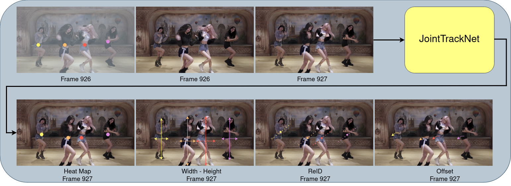
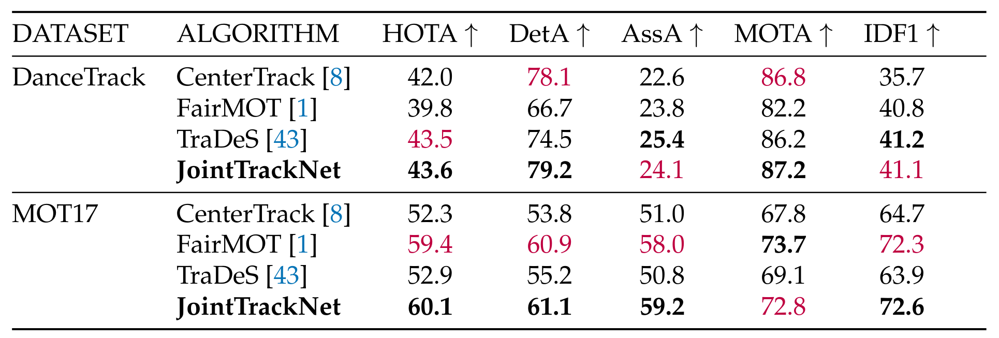

# JointTrackNet: Joint Detection, Embedding Extraction, and Motion Estimation in Multi-Object Tracking
Simultaneous object detection and tracking using displacement and ReID vectors:

Contact: [simsekfe@gmail.com](mailto:simsekfe@gmail.com). Any questions or discussion are welcome! 

## Abstract
We propose JointTrackNet, a novel multi-object tracking (MOT) framework that unifies object detection, motion estimation, and re-identification within a single, cohesive system. Designed to address the inherent challenges of maintaining tracking accuracy and identity preservation in complex environments, JointTrackNet leverages a multi-task learning approach to simultaneously detect objects, predict their movements, and extract unique identity features. Evaluations on the MOT17 and DanceTrack datasets demonstrate that JointTrackNet outperforms state-of-the-art trackers such as CenterTrack and FairMOT across key metrics, including Higher Order Tracking Accuracy (HOTA), Multi-Object Tracking Accuracy (MOTA), and Association Accuracy (AssA). The results underscore the framework's adaptability and effectiveness in diverse real-world scenarios, including surveillance, autonomous driving, robotics, and complex human activities. JointTrackNet represents a significant advancement in the field of MOT, establishing a new benchmark for tracking accuracy and reliability.

## Features at a glance

- Implementing object detection, embedding extraction, and offset regression within an end-to-end multi-task learning framework. 

- Evaluating the proposed MOT algorithm against publicly available MOT trackers.

- Our proposed algorithm, JointTrackNet, has surpassed the FairMOT algorithm by 3.8/0.7% and the CenterTrack algorithm by 1.6/7.4%  in terms of the HOTA (Higher Order Tracking Accuracy) score on DanceTrack and MOT17 datasets respectively.

## Main results

### Benchmarking of MOT Algorithms for two MOT datasets (Bold are the best, purple are the second.)

## Installation

Please refer to [INSTALL.md](readme/INSTALL.md) for installation instructions.

## Use JointTrackNet

We support demo for videos, webcam, and image folders. 

If you want to test with person tracking models, you need to add `--num_class 1`:

~~~
python demo.py tracking,embedding --load_model ../models/dancetrack.pth --num_class 1 --demo /path/to/image/or/folder/or/video 
~~~

For webcam demo, run     

~~~
python demo.py tracking,embedding --load_model ../models/dancetrack.pth --num_class 1 --demo webcam 
~~~

The result for the example images should look like:

You can add `--debug 2` to visualize the heatmap and offset predictions.

## Benchmark Evaluation and Training

After [installation](readme/INSTALL.md), follow the instructions in [DATA.md](readme/DATA.md) to setup the datasets. Then check [GETTING_STARTED.md](readme/GETTING_STARTED.md) We provide scripts for all the experiments in the [experiments](experiments) folder.

## License

JointTrackNet is developed upon [CenterNet](https://github.com/xingyizhou/CenterNet) and [CenterTrack](https://github.com/xingyizhou/CenterTrack). Both codebases are released under MIT License themselves. Some code of CenterNet are from third-parties with different licenses, please check the CenterNet repo for details. In addition, this repo uses [TrackEval](https://github.com/JonathonLuiten/TrackEval.git) for MOT evaluation. See [NOTICE](NOTICE) for detail. Please note the licenses of each dataset. Most of the datasets we used in this project are under non-commercial licenses.

